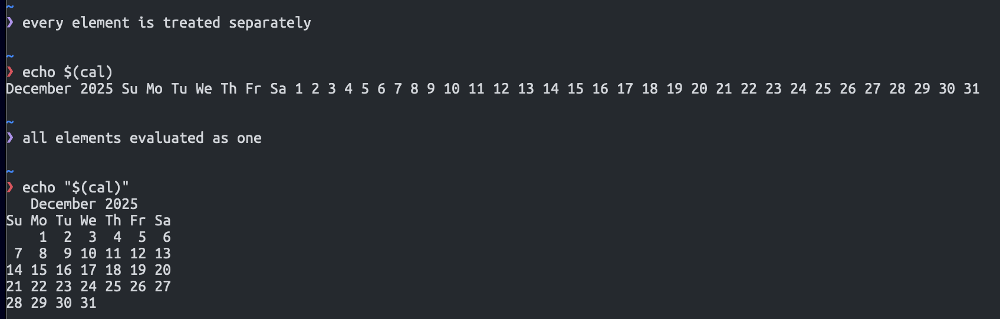

---
date:
  created: 2025-12-08
tags:
  - Linux
  - Bash
  - Behind the scenes
categories:
  - Linux
---

# Quoting in Bash

All so often we use quotes. In jinja templates, yaml files, etc. And if you are anything like me, <!-- more --> you are also confused about "when to use and when not to use" quotes.

Well, it always depends on the text you are writing, but we can take a behind-the-scenes look to understand how `bash` does it. And maybe we learn a thing or two.

## Double quotes

Double quotes make the special meaning of symbols go away, treating the contents of the text inside the double quotes as string literals. There are exceptions though:

The dollar sign, backslash and backtick characters still retain their special meaning.

This means that word splitting, pathname expansion, tilde expansion and brace expansion are suppressed; parameter expansion, arithmetic expansion, and parameter expansion are still possible.

A note on splitting words. When we use double quotes, words that would be many are being interpreted (and thus oftentimes printed to stdout) as one single string. Take this as an example:

* `echo $(cal)` :material-arrow-right: This prints every single text element next to each other on one line
* `echo "$(cal)"` :material-arrow-right: This prints the entire thing at once, respecting line breaks, etc.

## Single quotes

Single quotes suppress _all expansions_.

## Example

